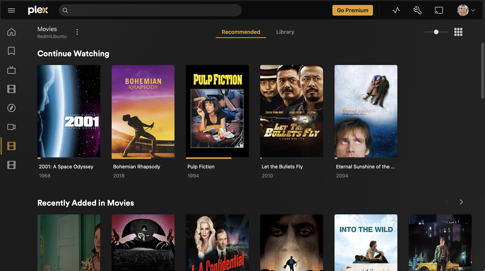
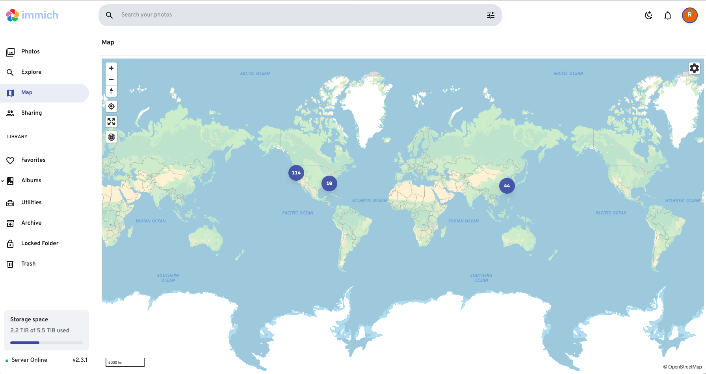
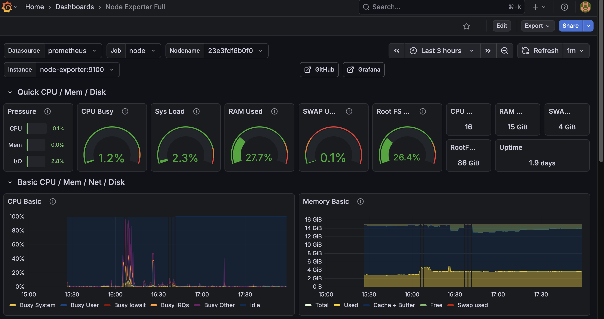
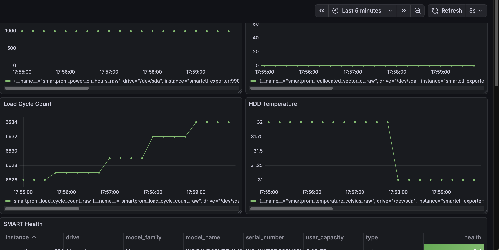

# Home-NAS

A fully containerized, low-cost home NAS built from an unused Windows laptop running Ubuntu 24.04.  
This project demonstrates practical system design, Linux configuration, Docker orchestration, persistent storage design, and multi‑service deployment (Plex, Immich, Samba, SMART monitoring).

The goal was to build a reliable, headless NAS and media platform using commodity hardware — with architectural thinking similar to production systems.

---

# 1. System Architecture

```
Laptop Hardware (Ubuntu 24.04)
│
├── Docker Engine
│   ├── Plex Media Server
│   ├── Immich (Server / Web / Microservices / Machine Learning)
│   ├── PostgreSQL (pgvector)
│   ├── Redis
│   ├── Prometheus + Node Exporter + cAdvisor
│   └── Grafana
│
└── External 5TB USB 3.0 HDD  →  mounted at /mnt/storage
      ├── Movies/
      ├── immich/
      ├── monitoring/
      └── SMB share for macOS access
```

### Design Principles

- **All app data lives on `/mnt/storage`**, not inside containers
- **Laptop runs headless** via SSH (no keyboard/monitor needed)
- **Docker Compose defines all services** and ensures reproducible builds
- **External drive auto‑mounts on boot via UUID**
- **Prometheus + Grafana monitor CPU, memory, containers, and disk SMART health**
- **Samba enables macOS Finder access to the NAS**

---

# 2. Preparing the Laptop (Ubuntu Setup)

### Install Ubuntu 24.04  
Repurpose the old Windows laptop → format → install Ubuntu.

### Prevent laptop from sleeping
To ensure Plex, Immich and downloads run all night:

```
sudo nano /etc/systemd/logind.conf
HandleLidSwitch=ignore
```

```
sudo systemctl restart systemd-logind
```

---

# 3. Mounting the 5TB External HDD

### 1. Identify drive
```
lsblk
```

Example:

```
sda1  →  5TB NTFS external HDD
```

### 2. Fix NTFS issues (required)
```
sudo ntfsfix /dev/sda1
```

### 3. Get the UUID
```
sudo blkid
```

### 4. Add to `/etc/fstab`
```
UUID=<YOUR-UUID> /mnt/storage ntfs defaults,uid=1000,gid=1000,umask=022 0 0
```

### 5. Mount
```
sudo mount -a
```

Folder structure:

```
/mnt/storage
├── Movies
├── immich
└── monitoring
```

---

# 4. SMB File Sharing (macOS Access)

Install Samba:

```
sudo apt install samba
```

Edit config:

```
sudo nano /etc/samba/smb.conf
```

Add:

```
[storage]
    path = /mnt/storage
    browseable = yes
    writeable = yes
    valid users = randy_ubuntu
```

Restart:

```
sudo systemctl restart smbd
```

On Mac Finder:

```
smb://<server-ip>/storage
```

---

# 5. Docker Compose Deployment (Plex + Immich)

Below is the full working stack:

```
services:
  immich-server:
    image: ghcr.io/immich-app/immich-server:release
    container_name: immich-server
    environment:
      DB_HOST: immich-db
      DB_PORT: 5432
      DB_USERNAME: postgres
      DB_PASSWORD: immich
      DB_DATABASE_NAME: immich
      REDIS_HOST: immich-redis
    depends_on:
      - immich-db
      - immich-redis
    volumes:
      - /mnt/storage/immich:/usr/src/app/upload
    ports:
      - "2283:3001"
    restart: always

  immich-machine-learning:
    image: ghcr.io/immich-app/immich-machine-learning:release
    container_name: immich-machine
    restart: always

  immich-web:
    image: ghcr.io/immich-app/immich-web:release
    container_name: immich-web
    ports:
      - "2284:3000"
    restart: always

  immich-microservices:
    image: ghcr.io/immich-app/immich-server:release
    container_name: immich-micro
    command: ["start-microservices.sh"]
    environment:
      DB_HOST: immich-db
      DB_PORT: 5432
      DB_USERNAME: postgres
      DB_PASSWORD: immich
      DB_DATABASE_NAME: immich
      REDIS_HOST: immich-redis
    depends_on:
      - immich-db
      - immich-redis
    volumes:
      - /mnt/storage/immich:/usr/src/app/upload
    restart: always

  immich-db:
    image: ghcr.io/immich-app/pgvector:16
    container_name: immich-db
    environment:
      POSTGRES_DB: immich
      POSTGRES_USER: postgres
      POSTGRES_PASSWORD: immich
    volumes:
      - ./postgres:/var/lib/postgresql/data
    restart: always

  immich-redis:
    image: redis:7
    container_name: immich-redis
    restart: always

  plex:
    image: lscr.io/linuxserver/plex:latest
    container_name: plex
    network_mode: host
    environment:
      - PUID=1000
      - PGID=1000
      - VERSION=docker
    volumes:
      - /mnt/storage/Movies:/data/movies
      - ./plex/config:/config
    restart: always
```

Deploy:

```
docker compose up -d
```


---

# 6. Monitoring Stack (Prometheus + Grafana + Node Exporter + cAdvisor + SMART)

Monitoring folder: `/mnt/storage/monitoring`

Features:

- Container CPU / memory / restarts (cAdvisor)
- Host CPU / RAM / Disk IO (Node Exporter)
- HDD temperature, bad sectors, lifespan (SMART)
- Grafana dashboards for everything

## SMART Exporter (HDD/NVMe S.M.A.R.T. health)

```
smartctl-exporter:
  image: prometheuscommunity/smartctl-exporter:v0.14.0
  container_name: smartctl-exporter
  restart: always
  privileged: true
  ports:
    - "9902:9902"
  devices:
    - "/dev/sda:/dev/sda"
    - "/dev/nvme0:/dev/nvme0"
  volumes:
    - "/run/udev:/run/udev:ro"
```

Exposes:

- Temperature  
- Reallocated Sector Count  
- Pending Sector Count  
- Offline Uncorrectable  
- NVMe wear %  
- CRC Cable Errors  

Prometheus scrapes all metrics.

Grafana visualizes them in a dashboard.


---

# 9. Power Management & Wake-on-LAN (WOL)

To reduce power consumption while keeping the NAS remotely accessible, suspend / resume and Wake-on-LAN (WOL) were configured and verified.

### Background

This NAS runs on a repurposed laptop rather than a traditional server.  
Unlike desktop NICs, laptop power management and USB Ethernet adapters make WOL significantly more complex, especially when the system enters S3 suspend.

The goal was:
- Allow the system to suspend when idle  
- Wake it remotely from another device on the same network  
- Keep all services (Plex, Immich, Docker) fully operational after resume  

---

### Network Interface & Capability Verification

The system uses a USB Ethernet adapter (`enxa0cec87e4e9f`) connected via wired LAN.

```
ip link
ethtool enxa0cec87e4e9f
```

Confirmed capabilities:
- Wake-on-LAN supported: `pumbg`  
- Magic packet wake (`g`) enabled  
- Link remains active during suspend  

This is a non-trivial setup, as many USB NICs lose power entirely during suspend.

---

### Enabling Suspend (systemd)

Initially, suspend was blocked by system configuration:

```
Unit suspend.target is masked, refusing operation.
```

This was resolved by unmasking suspend:

```
sudo systemctl unmask suspend.target
sudo systemctl unmask sleep.target
sudo systemctl unmask hibernate.target
sudo systemctl unmask hybrid-sleep.target
```

Suspend availability was verified via:

```
cat /sys/power/state
```

Result:

```
freeze mem
```

---

### Preventing Lid Events from Blocking Headless Operation

Because the system runs headless, lid close events must not interfere with power management.

```
sudo nano /etc/systemd/logind.conf
```

Configured:

```
HandleLidSwitch=ignore
HandleLidSwitchExternalPower=ignore
HandleLidSwitchDocked=ignore
```

Applied via:

```
sudo systemctl restart systemd-logind
```

SSH connectivity remains active while the lid is closed.

---

### Persisting WOL Configuration

To ensure WOL remains enabled after reboot or USB device reinitialization, a systemd service is used:

```
[Unit]
Description=Enable Wake-on-LAN
After=network.target

[Service]
Type=oneshot
ExecStart=/sbin/ethtool -s enxa0cec87e4e9f wol g

[Install]
WantedBy=multi-user.target
```

Enabled with:

```
sudo systemctl enable wol.service
```

---

### Wake-up Validation

The system was successfully woken from suspend using a magic packet sent from macOS.

This validated the complete chain:

```
Remote Device → Magic Packet → USB NIC → Kernel → systemd → Resume
```

All Docker services (Plex, Immich, monitoring stack) resumed normally after wake.

---

### Known Limitations
- USB Ethernet WOL is less reliable than motherboard NICs  
- After kernel updates or USB reconnection, WOL may need revalidation  
- Long suspend durations may increase failure probability  

Despite these constraints, the solution is reliable enough for daily home NAS usage.

---

# 10. Lessons Learned

- NTFS drives usually require repair before Linux mounting  
- Immich needs the pgvector-enabled Postgres image  
- Docker dependency order matters during first migration  
- SMB is the easiest way for macOS to interact with the NAS  
- A laptop + external drive is surprisingly capable as a homelab  
- Adding monitoring turns a DIY NAS into a semi‑professional system  
- SMART metrics provide early warnings of HDD failure  
- Laptop-based NAS setups require more power management tuning than desktops  
- Suspend can be silently blocked by systemd masking  
- USB NIC WOL can work, but only with correct kernel + systemd alignment  
- Observability (logs, journalctl, ethtool) is critical when debugging low-level issues  
- Treating a homelab like production infrastructure leads to better outcomes  

---

# 11. Future Enhancements

- Scheduled suspend / resume windows  
- Remote WOL via Tailscale or Cloudflare Tunnel  
- Public-domain HTTPS via Cloudflare + Caddy  
- Automated health checks post-resume  
- Secondary backup disk before aggressive power-saving policies  
